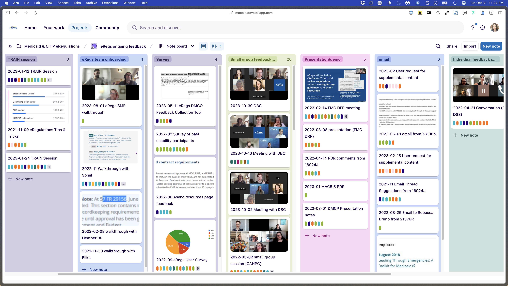

+++
title = "Research systems"
description = "Implementing research systems that scale."
date = 2026-03-12
[taxonomies]
tags = ["Research, Design"]
[extra] 
banner = "banner.png" 
toc = true 
toc_inline = true 
toc_ordered = true
+++

# Implementing research systems that scale

![Screenshot of the Medicaid & CHIP eRegulations tool homepage. The header displays 'Medicaid & CHIP eRegulations' in teal text on the left, with a 'Search Regulations' box on the right. Below is a teal banner containing navigation and search features: a 'Jump to Regulation Section' input field with a dropdown showing '§ 400' and a 'Go' button. Below are links to Title 42 - Public Health, Chapter 4, and Subchapters A - General Provisions and Subchapter C - Medical Assistance Programs. On the right is a box of recently added documents: Final Rules, Notices of Proposed Rulemaking, and Requests for Information.](static/eregs-product.png)

## The Problem

I joined the eRegulations team from the beginning as a half-time designer/researcher, splitting my time between this team and another. Early on, I contributed to research by learning how regulations are structured and used by policy experts and conducting comparative reviews of policy research tools.

But I was watching something troubling happen: the team had completed discovery research, but no one could see how it connected to the next phase of work. There was confusion and frustration. The discovery research existed, but it was organized in a way that only the original researcher understood. The team cared deeply about research, but the current system wasn't working.

When the researcher moved to another team, I stepped in to take over research. We were at a critical moment: we had mountains of discovery insights and a ton of evaluative research ahead of us. The team needed research to be accessible, usable, and collaborative.
## The Approach

### Diagnosing the System

I started by mapping the current state: where were research artifacts living? How were they organized? Who could access them? What happened when someone needed an insight?

The answer was scattered: discovery research in one part of the repository, no one understood the structure, templates didn't exist, and there was no shared understanding about what counted as "research" or "an insight." We needed a home and a shared vocabulary.

I created a conceptual model showing current state (above) vs. ideal state (below) – rough sketches in Excalidraw that I walked through with the product manager. I demonstrated how the team needed a "home" for research that connected outward to tools they already used (Dovetail, Google Docs, Mural), not a replacement system that required learning something new.

![Diagram showing Notion as the research home, with two interconnected databases: Research Panel (containing person records with identifier, email, and research activities) and Research Activities (containing activity records with title, subject/topic, and links to Google Docs, Dovetail data, and Mural boards). Arrows show how Notion links outward to three tools: Google Docs (for planning and facilitation, containing links to Notion activity, planning notes, protocol, script, and debrief notes), Dovetail (for storing and synthesizing data, containing links to Notion activity, recordings, transcripts, and highlights/tags), and Mural (for planning and synthesizing, containing links to Notion activity and planning/synthesizing work).](static/notion-home.png)

![Dashboard diagram titled 'plan/track/report' showing the Notion Research Panel and Research Activities databases at the center, with bidirectional arrows connecting them. From the Research Activities box, three arrows branch outward to three functional areas: Plan/Facilitate (Google Doc with title, link to Notion activity item, planning notes, protocol, script, debrief notes), Store/Synthesize (Dovetail Data with title, link to Notion activity item, additional metadata, recording, transcript, highlights/tags), and Plan/Synthesize (Mural board with planning/synthesizing work and link to Notion activity item).](static/notion-model.png)

### Building the Infrastructure

I designed two interconnected Notion databases:

**Research Participants** — who we talked to, what activities they participated in, relevant details
![Notion database table titled 'Research panel' showing a list of research participants. Columns include Name, Organization Affiliation, Panel Status (showing status tags in different colors: Active participant in green, Potential participant in yellow, Respondent in purple, Contacted in orange), Active user (checkbox column), and Role/Stakeholder Type (showing various role indicators). The database includes filter, view, and sort options, and serves as a record of every person the team talks to and their research participation history.](static/notion-panel.png)

**Research Activities** — what research we did, who participated, links to plans, conversation guides, synthesis boards
![Notion database table titled 'Research activities' with the description 'This database lists all the research activities the eRegulations team conducts with stakeholders and users.' Columns include Activity (showing research activity types like 'User interview with' and 'Feedback session with'), Date (showing study date ranges), Research panel (showing linked participant records), and Subject/purpose (showing research topics and purposes). The database includes table view, filter, and sort options, and demonstrates how research activities are tracked and linked to their participating research panel members.](static/notion-activities.png)

Notion became the hub. It linked out to Dovetail (our research repository), Google Docs (research plans and conversation guides), and Mural (synthesis boards). One system, multiple tools, clear connections.

I also created templates:
- Research plan template
- Conversation guide template
- Research insights template

The templates weren't just formats, they embedded good research practice. A research plan template that starts with "What do you want to know?" forces you to think about methodology before jumping to execution.

### Making Research Collaborative

I ran back-to-back evaluative research: early design concepts → mid-fidelity prototypes → live prototype testing. But I didn't do it alone.

I paired with designers and taught them:
- How to write a research plan guided by research questions
- How to facilitate a research session
- How to do collaborative analysis and synthesis

They ran usability tests, preference tests, surveys. The repository structure meant they knew exactly where to document findings and how to connect them to previous research.

The product manager and subject matter expert/policy expert started doing secondary research—literature reviews, competitive analysis, synthesis of existing data. They didn't have to start from scratch each time; they could leverage insights we'd already collected and carry that work forward for new initiatives.
## The Shift

**Before:** Research was a specialist activity that only one person did, and artifacts lived in a black box. Team members cared about research but felt locked out.

**After:** Research became a shared practice. The team understood the structure. Multiple people could contribute—designers running tests, PM doing secondary research, SME synthesizing policy implications. New team members could step in and immediately understand what had been done and why it mattered.

The "aha moment" for the team was seeing how easy it was to use multiple systems that work together—not replacing tools, but connecting them with clear logic.

## The Impact

### Immediate
- **Capacity expanded**: &nbsp; Designers, PM, and SME all contributing research activities
- **Research became usable**: &nbsp; Team could navigate it, understand it, build on it
- **Shared language emerged**: &nbsp; Everyone understood what "research question," "insight," "synthesis" meant

### Lasting

The systems I built outlived my tenure. The team was able to backfill my position with a junior researcher instead of a senior one, because the research practice and infrastructure were strong enough that a less-experienced researcher could step in and succeed.

When the team later faced a situation where they couldn't access users (for this policy research tool), they didn't slow down – they didn’t have to. They had two years of organized research to draw from. They leveraged existing insights and data to keep moving forward until they could conduct new research again.

When the junior researcher who replaced me was promoted to another team, he reflected on the value of the systems I built:

> "The most valuable thing was being able to go back to find things that we learned before, or research that was done before. I've become more appreciative of that because I've had to do a lot of that in my new project in Confluence. The previous team didn't have a super solid repository, and I've already run into things where there was this whole chunk of research that existed that I didn't have access to or didn't get to read about until now. Dovetail was pretty comprehensive in how it allowed me to find past research. I think that might be a factor of the structure that existed before—especially for eRegs. I think it was solid. I greatly benefited from there being a structure in the tool when I started

## Key Learnings

**Systems thinking matters as much as research skill**
You can do brilliant research, but if no one can find it or understand it, it doesn't compound. Building systems that make research accessible and usable is as important as the research itself.

**Trust enables systems work**
I had buy-in from my product manager because I built a high level of trust with her over time. That trust meant she was willing to invest time in redesigning how we worked, even when it wasn't directly tied to shipping a feature.

**Templates embed best practices**
A good template isn't just a format—it's a way to encode good research practice into the team's workflow. A research plan template that starts with research questions forces methodological thinking before execution.

**Capacity building is succession planning**
By making research collaborative and teaching others how to do it, I made myself less necessary. That's not a bug—it's the goal. The team's research capacity didn't depend on me staying; it depended on systems and skills that could outlive my tenure.

**Connect tools; don't replace them**
Teams already have tools they know. The breakthrough wasn't building a new system—it was creating a hub (Notion) that connected existing tools (Dovetail, Google Docs, Mural) with clear logic and shared language.

---

## This work exemplifies

- **Systems thinking** — diagnosing organizational problems and designing solutions that scale
- **Leadership without authority** — influencing how a team works through trust and clear thinking, not hierarchy
- **Knowledge transfer** — building systems and practices that outlive your tenure
- **Organizational design** — understanding that research is a practice, not a person
