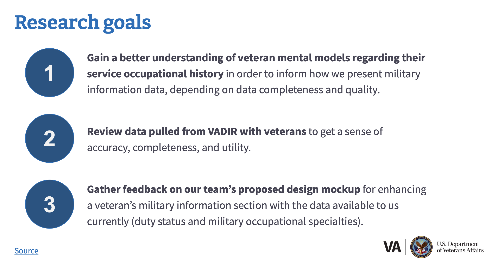
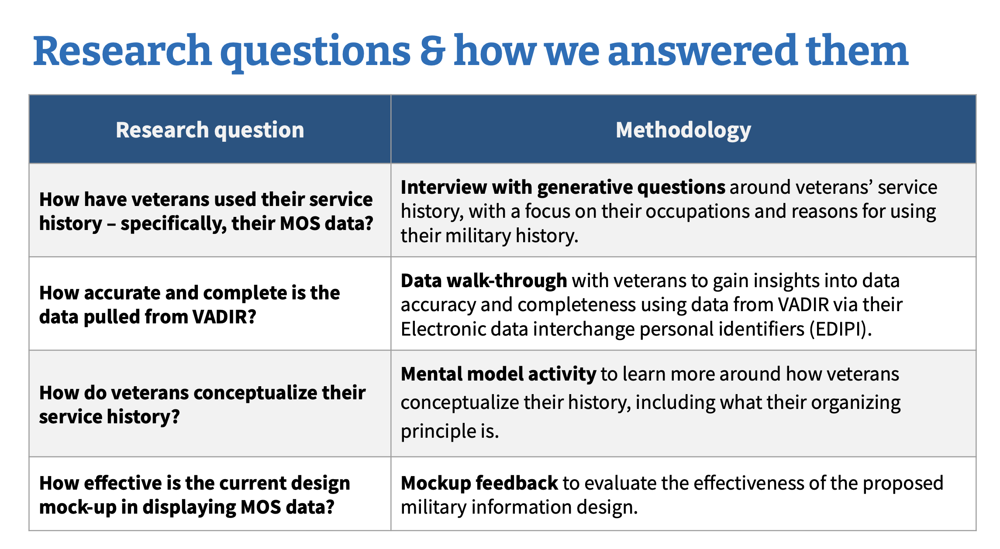
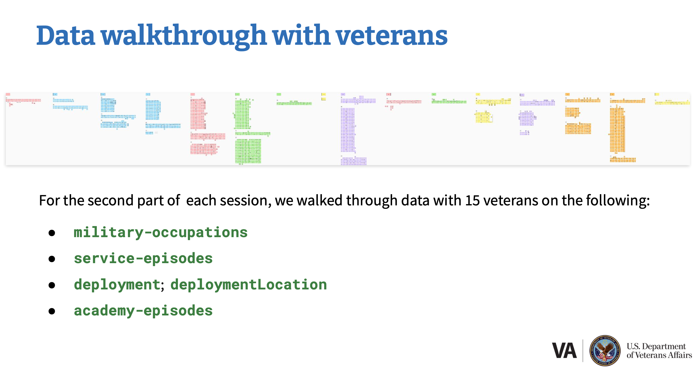
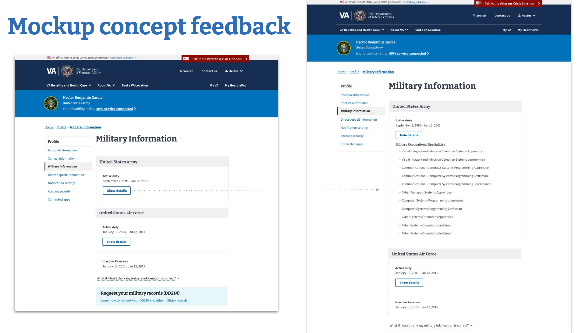

+++
title = "Turning ambiguous data into clear direction"
description = "Co-designing with veterans, not for them."
date = 2026-03-12
[taxonomies]
tags = ["Research, Design"]
[extra] 
banner = "banner.png" 
toc = true 
toc_inline = true 
toc_ordered = true
+++

# From ambiguous data to clear direction

## Context & challenge

### Problem
Veterans Affairs (VA) had a hunch that surfacing military service history in veterans' profiles could help them connect their service to disability claims, but no one understood how this data would actually appear to veterans or what impact it would have. The team had access to the underlying data structure, but couldn't visualize what veterans would see, much less whether the data was even accurate or useful.

### Users
16 veterans across all six military branches (Air Force, Army, Coast Guard, Marine Corps, Navy, Space Force), with varying service lengths, ranks, and service types. All had filed disability claims. 50% had filed PACT Act claims; 50% had served overseas. Participants ranged from ages 25–65+, with diverse education levels and geographic locations (5 urban, 11 rural).

### Constraints
- **Data quality unknown**: No one had validated VADIR (VA/DoD Identity Repository) data against veteran experience
- **Stakeholder uncertainty**: VEO and the Profile team couldn't decide which data elements were safe and useful to display without veteran input
- **Emotional stakes**: Veterans' military records impact their ability to access healthcare and disability benefits – data has consequences

## Research process

I conducted 16 semi-structured interviews with veterans, walked through their actual production data to validate accuracy, and used a mental model mapping activity to understand their priorities. 

Rather than showing wireframes, I partnered with our backend engineer to pull real VADIR data, convert JSON to CSV, and visualize it on Mural boards so veterans could validate it themselves—centering them as experts in their own experience.

### Key findings
- **Location > MOS for disability claims**: When connecting service to medical issues, location context was more useful than MOS alone
- **Data quality was worse than expected**: Service dates were off; MOS codes were inaccurate or missing; deployment data had duplicates and missing locations.
- **Veterans already have workarounds**: Veterans already use their DD214s, branch-specific records, and their own documentation to file claims.

Fortunately, **safe data did exist**: Branch of service, period of service type (active/reserves), and character of discharge were accurate for 13–15 of 15 veterans and genuinely useful.

## Design process

### Research-informed design direction
Rather than pursuing the original MVP scope (MOS + dates + duty status), I recommended a **data-quality-first approach**: only surface data elements that are accurate *and* useful.

- **Implement**: Period of service type (active/reserves) and character of discharge, as both had strong data quality and veterans found them valuable
- **Do not implement**: Military occupational specialties—data inconsistencies made them unreliable, and veterans already have better sources (DD214, SURF)
- **Monitor for future**: Deployment locations - veterans desperately want this, but data quality isn't there yet; recommend VEO prioritize DoD data improvements

I presented this not as "data is broken" but as "here's what we can safely ship now, here's what needs DoD partnership to fix, and here's why veterans care about each piece."

### Solution validation
Validation happened in real time during research sessions. Veterans validated their own data, articulated their priorities, *then* evaluated a mockup against those priorities. This meant feedback was grounded in their actual needs, not abstract preferences.

## Final design

### Design solutions
Period of service type (active duty, reserves, etc.) and character of discharge were added to the VA.gov Profile military information section, displaying alongside branch of service and service dates.
### Design decisions
**Why period of service type and discharge?**
- **Accuracy**: 15/15 veterans confirmed branch data was correct; 13/15 confirmed discharge type was correct
- **Utility**: Veterans found value in seeing active vs. inactive reserves status; discharge type matters for benefits eligibility
- **Trust**: These data elements are already on DD214s, so veterans can verify them independently

**Why not MOS?**
- Only 3/10 veterans said their MOS codes were actually accurate.
- Effective dates were wrong for 5/10 veterans, indicating deeper issues.
- Veterans already have better sources (DD214, branch-specific records).

By showing inaccurate data *to the veterans it belonged to*, stakeholders immediately understood the stakes. One veteran saw discharge information that contradicted their DD214—information they'd been fighting for years to correct. That emotional understanding led to concrete action: VEO updated their roadmap to prioritize DoD data quality improvements, and the team shipped only the data elements they could confidently stand behind.

### Accessibility & inclusive design
Trauma-informed facilitation prioritized veterans' interpretation of their own data and made clear that confusing or inaccurate information was a *system problem*, not their misunderstanding—essential when data represents lived experience and directly impacts access to healthcare and benefits.

## Impact & outcomes

### What shipped
Period of service type and character of discharge were added to the VA.gov Profile military information section. All veterans with authenticated VA.gov Profile accounts can now see this information—millions of veterans. Implementation occurred approximately summer 2024, a few months after research concluded in March 2024.

### Metrics & results
#### ☞ Recs implemented 
Both recommended data elements were built and deployed
#### ☞ Roadmap influenced
VEO updated their roadmap based on findings, prioritizing efforts to improve data quality
#### ☞ Veterans reached
Millions of veterans now have access to more complete military service information in their profiles

### Key learnings

#### Real data > synthetic data
Pulling actual production data and having veterans validate it revealed problems no amount of wireframe testing could have surfaced. One veteran's inaccurate discharge information made the stakes visceral for stakeholders.

#### Trauma-informed research is essential
Several veterans found it traumatizing to see inaccurate information about their own service—especially those whose military careers were cut short by injury. Adjusting facilitation to prioritize their interpretation was necessary to   get honest feedback and maintain trust.

#### Partnership is force multiplier
I could not have done this research without my backend engineer extracting JSON into workable CSV format. That collaboration—data expertise + research/design expertise—made the research possible and credible to stakeholders.

#### Mental models reveal priorities
The mapping activity fit real data validation, mental model discovery, *and* mockup feedback into an hour-long session. Each activity built on the previous one, so feedback was concrete and actionable, not abstract.

#### "Do not build" is a valid research outcome
Recommending *against* MOS implementation was only possible because I had data to back it up. By showing inaccurate data to veterans and documenting gaps, I could present the recommendation as "here's what we can ship safely now, here's what needs fixing first" rather than "this is a bad idea."

---

## View the real artifacts from this study
> **[Research questions & recruitment plan](https://github.com/department-of-veterans-affairs/va.gov-team/blob/master/products/identity-personalization/profile/Research/2024-01-military-info-enhancement-mvp/research-plan.md)**
> This plan helped everyone on our team get on the same page and make sure that we were asking the right questions, and that we’d get actionable answers. I worked with Perigean, VA.gov’s recruitment partner, to recruit veterans as research participants.
> 
> **[Conversation guide](https://github.com/department-of-veterans-affairs/va.gov-team/blob/master/products/identity-personalization/profile/Research/2024-01-military-info-enhancement-mvp/conversation-guide.md)**
> This is the structure I used for each research session to guide myself through each part.
> 
> **[Findings & recommendations](https://github.com/department-of-veterans-affairs/va.gov-team/blob/master/products/identity-personalization/profile/Research/2024-01-military-info-enhancement-mvp/research-findings.md)**
> These were my initial research findings. The information is quite dense, but my team used this format, and it worked well internally, but it is not as friendly for stakeholders.
> 
> **[Stakeholder readout](https://github.com/department-of-veterans-affairs/va.gov-team/blob/master/products/identity-personalization/profile/Research/2024-01-military-info-enhancement-mvp/research-readout.pdf)**
> This is the research readout I did for the VEO stakeholders. I don’t typically add my speaker notes to presentation pdfs, but even in PPT form, the information is dense, and I wanted each slide to stand alone. This came in handy when the stakeholders asked for my research artifacts as they were ready to discuss and approve my recommendations.
